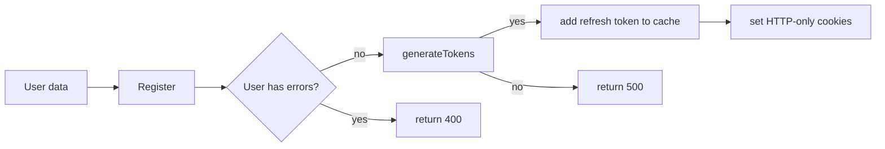
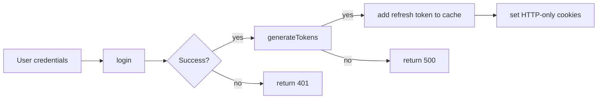
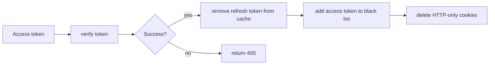
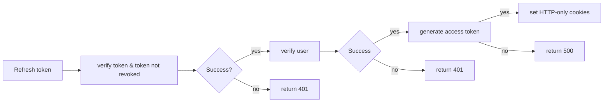
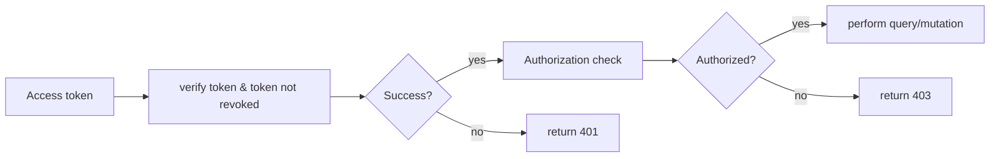
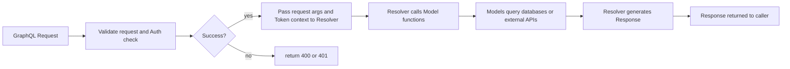

# DMSP Backend Prototype

# dmsp_frontend_prototype app


## Table of Contents
- [Introduction](#introduction)
- [Features](#features)
    - [Authentication](#authentication)
    - [GraphQL](#graphql)
- [Getting Started](#getting-started)
    - [Prerequisites](#prerequisites)
    - [Installation](#installation)
    - [Running the App](#running-the-app)
    - [Building for Production](#building-for-production)
    - [Managing the databases](#managing-the-database)
- [Querying the Apollo Server](#querying-apollo-server)
    - [Pagination](#pagination)
    - [Errors](#errors)
- [Development](#development)
    - [Data Model](#data-model)
    - [Adding or updating GraphQL functionality](#adding-or-updating-graphql-functionality)
    - [Context](#context)
    - [Schemas](#graphql-schemas)
    - [Resolvers](#resolvers)
    - [Models](#models)
    - [Mocks](#mocks)
    - [Internationalization / Language support](#languages)
    - [Tests](#tests)
    - [Conect to ECS instance](#connect-to-ecs-instance)
- [Environment variables](#environment-variables)
- [Routes](#routes)
- [Contributing](#contributing)
- [Contributors](#contributors)
- [License](#license)

## Introduction

This system is an [Apollo Server](https://www.apollographql.com/docs/apollo-server/) that support [GraphQL](https://graphql.org) interactions.

The primary purpose of this system is to be the backend for the [corresponding DMP Tool's nextJS based user interface](https://github.com/CDLUC3/dmsp_frontend_prototype?tab=readme-ov-file#running-the-app).

It has been decoupled from that system though in order to facilitate its use beyond the DMP Tool. For example if a University wants to develop an in-house integration, they can use the authentication endpoints to authenticate their users and interact with both templates and data management plans directly.

GraphQL makes these types of integrations easier than a standard REST API.

## Features

Our Apollo server consists of:
- Authentication: Endpoints that can be used to verify a user's identity and provision tokens that can then be used to access data.
- Data Sources: Code used to communicate with local databases, external APIs, caches and file systems
- GraphQL Schemas: The definition of our Graph including types, queries and mutations
- Resolvers: The code that processes incoming queries and uses the available data sources to generate the response
- Mocks: Stub or placeholder data that can be returned when a resolver has not yet been developed

### Security

**CORS**
The system uses CORS to ensure that traffic only comes from approved callers.

**CSRF**
The system uses the `X-CSRF-Token` header to store CSRF tokens. CSRF tokens are generated on each request. The token is hashed and stored in the Redis cache to ensure that it has not been tampered with. When the caller submits a non-GET (or OPTIONS or HEAD) request, they must include the CSRF token.

**Access/Refresh Tokens**
Once a user signs in, the system generates an Access Token and a Refresh Token. The refresh token is hashed and stored in the Redis cache. The system then stores these tokens in HTTP-only cookies: access token `dmspt` and refresh token `dmspr`.


### Authentication

The system provides a few endpoints that exist outside the Apollo Server GraphQL context. These endpoints allow a user to authenticate and acquire JSON web tokens which are placed into HTTP-only cookies. Those cookies are then used to perform authorization checks when running GraphQL queries.

The system generates a short lived (10 minute) access token `dmspt` that should be used on all requests to the GraphQL endpoint.

A longer lived (24 hour) refresh token `dmspr` is also generated. The refresh token can be used to refresh an expired access token. Doing so generates completely new access AND refresh tokens.

When the user signs out, their access token is added to the Redis cache black list to ensure that it cannot be used afterward.

#### signupController
The signup controller responds to `POST` requests to `/apollo-signup`. It will validate the posted user data in the body of the request and attempt to create a new User record in the database.

If successful, a new User record is created and an access token and refresh token are generated. The refresh token is stored in the Redis cache and then both tokens are added to the response as HTTP-only cookies.

#### signinController
The signin controller responds to `POST` requests to `/apollo-signin`. It will validate the posted user email and password in the body of the request and attempt to locate the User record in the database. If the user is found the system will validate the password.

If successful, an access token and refresh token are generated. The refresh token is stored in the Redis cache and then both tokens are added to the response as HTTP-only cookies.

#### signoutController
The signout controller responds to `POST` requests to `/apollo-signout`. It will retrieve the access token from the request's HTTP-only cookies and attempt to verify the token. If the token is still valid it will proceed with the signout.

If successful, the refresh token will be removed from the Redis cache. Then the access token will be added to the black list on the Redis cache and then both HTTP-only cookies will be deleted.

#### refreshTokenController
The signout controller responds to `POST` requests to `/apollo-refresh`. It will retrieve the refresh token from the request's HTTP-only cookies and attempt to verify the token. If the token is still valid.

If successful, a new access token will be created and replace the existing one in the response's HTTP-only cookies.

#### GraphQL requests
The access token received from the authentication endpoints above will then be used by the system to determine whether or not a user is authorized to access certain data.


### GraphQL

GraphQL consists of:
- Schemas - the definition of the available data (e.g. a contributor or an answer to a DMP question) and what actions can be performed on that data
  - Queries - actions that can be taken to retrieve different types of data. GraphQL is extremely flexible and allows the caller to define exactly what portions of the data they want the query to return.
  - Mutations - actions that can be taken to create, modify or delete different types of data.
- Resolvers - an intermediary that receives the incoming query or mutation request and performs authorization checks and basic validation before passing the request off to a model.
- Models - encapsulate the business logic that performs queries and mutations on data. The models understand where the data lives and how to interact with it.
- Data Sources - lower level logic that allows models to interact with data (e.g. a MySQL database, DynamoDB database, external API, etc.)

GraphQL/Apollo Server request -> response cycle


## Getting Started

### Prerequisites
- Node.js v21.6.0 or higher
- npm v10.2.0 or higher
- Docker Desktop -- Docker Desktop gives you Docker Engine, Docker CLI client, and Docker Compose

### Installation
- Clone this repository to your local machine
- Create your dotenv file the `cp ./.env.example ./.env`
- Update the new `.env` file if necessary (make sure it has no references to MYSQL unless you want to override the docker-compose db setings)
- Run `docker-compose build` to build the container
- Once the build has completed start the container with: `docker-compose up`
- In a separate tab run `docker-compose exec apollo bash ./data-migrations/database-init.sh` to create the database and build the `dataMigrations` table which will be used to track which data migrations have been run.
- Then run `docker-compose exec apollo bash ./data-migrations/process.sh` to build out the remaining database tables and seed them with sample data
- Visit `http://localhost:4000/graphql` to load the Apollo server explorer and verify that the system is running.

### Running the app

Once the application is installed and the database has been initialized you can start the Apollo server with: `docker-compose up`

This will startup a docker container that consists of a local Redis cache, a MariaDB database, and the Apollo server node.js application.

Once the container is up and running you can visit `http://localhost:4000/graphql` to load the Apollo server explorer and verify that the system is running. For an overview of how the explorer works, please refer to the offical [docs for the GraphOS Studio Explorer](https://www.apollographql.com/docs/graphos/explorer/)

### Building for production

You can manually build the application for your production environment by running `docker run build` and then `docker run start` to startup the application.

When deploying manually, you will need to ensure that all of the environment variables defined in the `.env.example` and the `docker-compose.yaml` are available to the application. This can be done via a `.env` file or environment variables.

If you plan on deploying to the AWS cloud, you can refer to the [corresponding AWS infrastructure repository](https://github.com/CDLUC3/dmsp_frontend_prototype?tab=readme-ov-file#running-the-app). For the CloudFormation templates needed to build this application using CodePipeline and then host it within an ECS cluster.

### Managing the databases

The system has a DynamoDB Table and a MySQL database. Please note that the Docker container must be running to execute any of these commands!

You can run AWS CLI commands to interact with the DynamoDB table or MySQL commands to interact with that database by using `docker-compose exec`.

#### DynamoDB

- To create a local instance of the DynamoDB table, startup the Docker container and run `docker-compose exec apollo bash ./data-migrations/dynamo-init.sh`. This will create the table if it does not already exist

#### MySQL

**Running Database Migrations**
This system manages the database schema via SQL files located in the `./data-migrations` folder.

- While the Docker container is up and running, just run `docker-compose exec apollo bash ./data-migrations/process.sh` in a seperate terminal window. This script will create both the database and the `dataMigrations` table if they do not yet exist.

When you run `process.sh` the script checks each SQL file located in the `./data-migrations/` folder sequentially by the date/time prefix (e.g. `2025-04-18-1235-run-me.sql` is checked after `2025-04-17-1200-run-me.sql`).

It queries the `dataMigrations` table to see if the file has already been run. If it has not, it executes the SQL within the file and then records the file name in the `dataMigrations` table so that it does not get run again.

#### Dropping all of the MySQL tables in the local database

In the event that you want to delete all of the tables and data from your database and rebuild a clean database you can run: `docker-compose exec apollo bash ./data-migrations/nuke-db.sh`

You may find that you receive an error that the `dataMigrations` table already exists when running the `process.sh` script. If so, restart the container and try again.

#### Connecting to an AWS RDS instance

The development, stage and production environments use AWS RDS to host the MySQL databases. You can use the session manager utility to setup port forwarding on your local machine so that you can connect to these MySQL databases using Sequel Ace or similar tools. To establish the port forwarding connection:
- Log into the AWS console 
- Navigate to the ECS page and note the name of our Fargate cluster
- Navigate to the RDS page and note the endpoint URL for the RDS instance
- Open a terminal window
- run `session port [CLUSTER-NAME] [RDS-ENDPOINT]  3306:3306`

## Querying Apollo Server

You can interact with the Apollo server from your external system by submitting requests to any of the server's GraphQL queries or mutations.

Please review the latest [GraphQL Schema files](https://github.com/CDLUC3/dmsp_backend_prototype/tree/main/src/schemas) for a list of the the up-to-date data types, queries and mutations available.

Here is an example call to fetch the list of collaborators for a DMP template:
```ts
import fetch from 'node-fetch';

// Replace with your actual GraphQL endpoint
const GRAPHQL_ENDPOINT = 'http://localhost:4000/graphql';
// Replace with the actual access token
const ACCESS_TOKEN = 'your_access_token_here';

const query = `
  query TemplateCollaborators($templateId: Int!) {
    templateCollaborators(templateId: $templateId) {
      id
      email
      invitedById
      userId
      templateId
    }
  }
`;

const variables = {
  templateId: 123, // Replace with the actual template ID
};

async function fetchTemplateCollaborators() {
  try {
    const response = await fetch(GRAPHQL_ENDPOINT, {
      method: 'POST',
      headers: {
        'Content-Type': 'application/json',
        'Authorization': `Bearer ${ACCESS_TOKEN}`,
      },
      body: JSON.stringify({
        query,
        variables,
      }),
    });

    const result = await response.json();

    if (result.errors) {
      console.error('GraphQL errors:', result.errors);
    } else {
      console.log('Template Collaborators:', result.data.templateCollaborators);
    }
  } catch (error) {
    console.error('Error fetching template collaborators:', error);
  }
}

fetchTemplateCollaborators();
```

### Pagination

The system supports both offset and cursor based pagination. Offset pagination uses `offset` and `limit` to allow you to move forward and backward within the resultset. Cursor pagination uses a `cursor` and `limit` to allow you to move forward within the resultset.

Cursor pagination is designed to support endless-scroll or "load more" scenarios. It is more efficent than Offset pagination, so is preferred.

Offset pagination is designed to support traditional `First 2, 3, 4, 5 ... Last` style page navigation. It is slower though so not the preferred approach unless you truly need to provide users with the ability to move forward and backward or jump to a specific page.

When calling one of the queries that supports pagination, you pass in a set of `paginationOptions`.
- `limit` the number of records that should be returned (default is 20 with a max of 100)
- Cursor specific:
  - `cursor` either `null` (the start of the list) or a cursor id
- Offset specific:
  - `offset` either `0` (the start of the list) or a specific position within the list
  - `sortField` the field you want to sort the results on
  - `sortDir` the direction of the sort, either `ASC` (default) or `DESC`

For example this query sends cursor information to get the first 20 affiliations matching the criteria:
```
query Affiliations($name: String!, funderOnly: Boolean, $paginationOptions: PaginationOptions){
  affiliations(name: $name, funderOnly: $funderOnly, paginationOptions: $paginationOptions) {
    limit
    totalCount
    nextCursor
    hasNextPage
  }
}

variables: {
  "name": "NSF",
  "funderOnly": true,
  "paginationOptions": {
    cursor: null
  }
}
```
The response has:
- `hasNextPage` a flag indicating whether there is a subsequent page of results
- `hasPreviousPage` a flag indicating whether there is a prior page of results
- `nextCursor` the cursor that should be sent to fetch the next set of records
- `totalCount` the total number of possible results
- `availableSortFields` a list of fields that can be used to sort the results

This query sends offset information to get the first 20 affiliations matching the criteria:
```
query Affiliations($name: String!, funderOnly: Boolean, $paginationOptions: PaginationOptions){
  affiliations(name: $name, funderOnly: $funderOnly, paginationOptions: $paginationOptions) {
    limit
    totalCount
    currentOffset
    hasNextPage
    hasPreviousPage
    availableSortFields
  }
}

variables: {
  "name": "NSF",
  "funderOnly": true,
  "paginationOptions": {
    offset: 0
  }
}
```

The response has:
- `hasNextPage` a flag indicating whether or not there is a subsequent page of results
- `hasPreviousPage` a flag indicating whether or not there is a prior page of results
- `currentOffset` the current offset position of the first item in the results
- `totalCount` the total number of possible results
- `availableSortFields` a list of fields that can be used to sort the results

To fetch the next set of results, you can use `currentOffset + limit`

#### Making a query that supports pagination

Pagination queries use the `queryWithPagination` function on the `MySqlModel` class (as opposed to the `query` function).

Refer to the `AffiliationSearchResult.search` or `VersionedTemplateSearchResult.search` functions for examples of how to structure your query.


### Errors

The system provides 2 levels of errors.

1. **GraphQL errors**: The equate to HTTP status codes and are not typically resolvable by an end user.
  1. **400: Bad Request/User Input** There was an error with the structure of your request. These errors are fairly descriptive. Make sure you review the GraphQL schema to make sure you're refering to the correct fields.
  2. **401: Unauthorized** The user's access token is missing or is no longer valid
  3. **403: Forbidden** The user does not have permission to perform the requested action
  4. **404: Not Found** The requested mutation was for a record that does not exist
  5. **500: Internal Server** An internal error occurred within this application.
2. **Object level errors**: These errors provide information that the user can use to address the issue(s)
  1. **Object.errors.general** Errors that are not specific to a field (e.g. "Failed to send email", "Unable to delete", etc.)
  2. **Object.errors.field** An error that applies to a specific property of the object (e.g. "Name can't be blank", "Invalid URL", etc.)

### If your system is written in JS or TS

We recommend making use of the [official Apollo Client](https://www.apollographql.com/docs/react) to handle communications with this Apollo server implementation.

You can also run `npm run generate` on this repository to generate the `src/types.ts` file and import the types into your application.


## Development

The local development environment is encapsulated within a docker container. To build and run the development Docker containers:
- `docker-compose build`
- `docker-compose up`
To stop the docker container, run:
`docker-compose down`
Run the following to check that your container is up:
`docker container ls -a`
To run bash commands within the container (e.g. to run DB migrations):
`docker-compose exec apollo bash path/to/script`

### Data Models

This system uses several data sources: A MySQL database, a DynamoDB table and a Redis cache to store information.

The Redis cache is used to store ephemeral data like refresh tokens and GraphQL query results. This data has TTL settings.

The DynamoDB Table (aka the DMPHub) stores the metadata for a DMP in the [DMP Metadata Standard developed by the Research Data Alliance (RDA)](https://github.com/RDA-DMP-Common/RDA-DMP-Common-Standard).

In development, you can review the JSON store in the DynamoDB table by executing AWS CLI commands from within the docker container for the apollo server application.

The key structure we use is
- Partition key: `PK` with a prefix of `DMP#` and then either:
  - The structure of the DMP ID is a DOI without the protocol (e.g. `DMP#doi.org/11.22222/A1B2C3`)
  - When the plan's DMP ID is published/registered with EZID/DataCite, the record will include a `registered` timestamp
  - If the plan doesn't have a `registered` value then we have only "reserved" the DOI. It has not yet been minted/published
- Sort key: `SK` with a prefix of `VERSION#`. The version can be either `VERSION#latest` or a specific historical version as `VERSION#2025-04-08T09:20:00.000Z`

To fetch a specific item you can run something like:
`aws dynamodb get-item --key "{\"PK\":{\"S\":\"DMP#doi.org/11.22222/A1B2C3\"}}" --table-name $DYNAMO_TABLE_NAME --endpoint-url $DYNAMO_ENDPOINT`

To scan the table for multiple items you can run something like this that returns all the unique `PK` and `SK`:
`aws dynamodb scan --table-name $DYNAMO_TABLE_NAME --endpoint-url $DYNAMO_ENDPOINT --filter-expression "SK = :sk" --expression-attribute-values "{\":sk\":{\"S\":\"VERSION#latest\"}}" --projection-expression "PK, SK"`

When querying the local DynamoDB Table you will need to specify the dummy credentials and the endpoint url:
`AWS_ACCESS_KEY_ID=DUMMYIDEXAMPLE AWS_SECRET_ACCESS_KEY=DUMMYEXAMPLEKEY aws dynamodb get-item --table-name localDMPTable --endpoint-url http://localhost:8000 --key "{\"PK\":{\"S\":\"DMP#dmsp.com/10.48321/D11bcc3acd\"},\"SK\":{\"S\":\"VERSION#latest\"}}"`

The MySQL database stores everything else (Templates, Guidance, Plan Feedback, Users, Affiliations, etc.). It also maintains a projectDOIs table that links Projects to the Plan DOIs to facilitate access to the DMPs stored in the DynamoDB table.

The links for the data model images won't work until we have them in the `main` branch, so adding placeholders for now. Once merged we can come back and update these to display the images
- 
- 


### Adding or updating GraphQL functionality

If you need to add additional Queries and/or Mutations, you will typically need to update 3 distinct sections of the Apollo server framework.
1. GraphQL Schema: The definition of the structure of an object and any queries and mutations that can be performed against that object.
2. Resolvers: Handlers for determining out how to respond to Query and Mutation requests
3. Models: The business logic associated with an object as well as how to interact with it's underlying data source (e.g. API calls, SQL queries, etc.)

#### Context
Our context is defined in `src/context.ts` and consists of several items that are instantiated when the server starts up or as part of processing the incoming request.
- **token**: The JWT token passed in the header of the request.
- **cache**: The Apollo server cache.
- **dataSources**: An object containing the MySQL DB connection pool and the DMPHub API wrapper

#### GraphQL schemas

[Official Apollo Server docs for schemas](https://www.apollographql.com/docs/apollo-server/schema/schema)

To add Queries or Mutations you should locate the appropriate schema in the `src/schemas` directory. If you have a completely new entity you want to add, then create a new schema file in that directory (use an existing one as reference) and then be sure to import it into `src/schemas.ts` and make sure it is getting passed to the Apollo server.

Once a schema has been added/modified, you will need to run `npm run generate` this kicks off a script that builds out Typescript Types for the new schema and queries.

#### Resolvers

[Official Apollo Server docs for resolvers](https://www.apollographql.com/docs/apollo-server/data/resolvers/)

Resolvers can be found in the `src/resolvers/` directory. You should have a corresponding Query and Mutation for each one defined within the GraphQL schema.

A resolver receives the following for each request:
- **parent**: The parent object (only applicable when chaining - see below)
- **input**: The query params received from the caller (e.g. templateId, email, etc.)
- **context**: The apollo server context (see below).
- **info**: N/A (so far)

Resolvers are responsible for doing basic input validation and performing authorization checks (e.g. is the person an ADMIN?). They then hand off the request to a Model.

#### Chaining
GraphQL using a concept called [chaining](https://www.apollographql.com/docs/apollo-server/data/resolvers#resolver-chains) to resolve complex queries that request access to multiple object types.
When you define a relationship between objects within the GraphQL schema, resolvers will be called when appropriate to retrieve each object.

For example, assume the following schema:
```
extend type Query {
  user(userId: Int!): User
}

type User {
  id: Int
  email: String!
  affiliation: Affiliation!
}
```

In this schema, we have a query to fetch a user record. The User object exposes a reference to an asscoiated affiliation.

GraphQL allows the caller to dictate what data they want to receive back from a query request. So, if the caller requests:
```
query user($userId: Int!) {
  user(userId: $userId) {
    email
  }
}
{
  "userId": 1
}
```
Apollo server will call the resolver for the user to fetch the email from the database but will ignore the associated affiliation because the caller did not request it.

If on the other hand the caller asked for the affiliation in the request:
```
query user($userId: Int!) {
  user(userId: $userId) {
    email
    affiliation {
      id
      name
    }
  }
}
{
  "userId": 1
}
```
Apollo server will call the resolver to get the email and affiliationId for the user from the database. Once it has retreived the affiliationId, it will make a subsequent call to the DMPHub API to fetch the ROR id and the name of the affiliation.

To define chainging in the resolver you would do something like this:
```
  Query: {
    // Resolver exposed by GraphQL
    user: async (_, { userId }, context: MyContext): Promise<User> => {
      return await User.findById('user resolver', context, userId);
    },
  },

  User: {
    // Chained resolver to fetch the Affiliation info for a user
    affiliation: async (parent: User, _, context): Promise<Affiliation> => {
      return Affiliation.findById('Chained User.affiliation', context, parent.affiliationId);
    },
  },
```

If you added a new resolver, be sure to import it into the `src/resolvers.ts` file and include it for Apollo Server.


### Models

Models can be found in the `src/models` directory. They typically contain all of the business logic for accessing and modifying data. They are called by Resolvers and interact with Data Sources.

They are also used to normalize data from the data sources before returning it to the caller. For example:
- If my data source returns a property called `funder_id` and I want to send a boolean flag called `isFunder` to the caller, I perform the logic in a Model.
- If I simply want to rename a property prior to returning it to the client like the data source returning `identifier` but needing to send `DMPId` to the caller.

There are abstract base classes available to help offload some of the redundant code. For example the MySqlModel provides standardized fields common to every DB record as well as `query`, `insert`, `update` and `delete` functions that handle calls to the DB.

### Mocks

In some situations, the data source will not be ready. In this scenario you can create a mock for use during development. Mocks live in `src/mocks/` and there is an example for affiliations there.

To use a mock, simply import it into your resolver and then setup your Query and Mutation handlers to interact with the canned mock data.

Note that mocks will refresh each time the server is restarted!

### Languages

The languages supported by the system can be found in the `src/models/language.ts` file.

TODO: update with documentation on how to provide translation support for DB based text

### Tests

You should try to add unit tests any time you add or modify a file! To do so, find the corresponding file (or add a new one) in the `src/models/__tests_/` directory. We appreciate unit tests everywhere else too!

Resolver tests make use of mocks to simulate interaction with datasources. These mocks can be found in `src/models/__mocks__`. By using these mocks we are able to perform end-to-end integration testing.

To run the unit tests `npm run test`

### Connect to ECS instance

If you are running your application within an AWS ECS cluster. You need to do the following to connect to the container.

First run the command to list the task ARNs: `aws ecs list-tasks --cluster [Cluster Name]`.

Which will return something like this, where the last part of the ARN is the task id:
```
{
    "taskArns": [
        "arn:aws:ecs:[region]:[account]:task/[cluster]/[task id]"
    ]
}
```

Then run the following to connect to the task container:
`aws ecs execute-command --cluster [Cluster Name] --task [Task id] --interactive --command /bin/sh`

## Environment variables

See the `.env.example` file and the `docker-compose.yaml` for the list of environment variables currently required by the system.

If you are running locally and using the docker container, you simply need to make a copy of the `.env.example` file and update it's variables where appropriate: `cp .env.example .env`.

If you are running elsewhere, you will need to either make a copy of the `.env.example` as described above and add all of the variables for the `docker-compose.yaml` to it, OR set these environment variables up individually.

# Routes
- `/up` - a simple healthcheck endpoint which can be used by load balancers

- `/apollo-signin` - authenticate a user and receive an access token
- `/apollo-signup` - register a new user and receive an access token
- `/apollo-signout` - delete an access token
- `/apollo-refresh` - regenerate an expired access token

- `graphql` - perform a GraphQL query or mutation

- `/apollo-authenticate` - OAuth2 endpoint to authenticate an external system and receive an access token
- `/apollo-authorize` - OAuth2 endpoint to allow a user to authorize the external system to access their data. Returns a short lived authorization code
- `apollo-token` - OAuth2 endpoint to exchange an authorization code for a long lived access token

## Contributing

1. Clone this repo
2. Create a new branch prefixing branch with `bug`, `chore` or `feature` based on type of update: `git checkout -b feature/your-feature`
3. Add your changes and add commit message: `git add .; git commit -m "added new feature`. A pre-commit is run with the commit which checks to make sure linting and test coverage pass before a commit goes through
4. Push your branch up to this repo: `git push --set-upstream origin feature/your-feature`
5. Open a Pull Request in github

## Contributors

- [Brian Riley](https://github.com/briri)
- [Juliet Shin](https://github.com/jupiter007)

## License

This project is licensed under the MIT License - see the [LICENSE](LICENSE) for for details.
