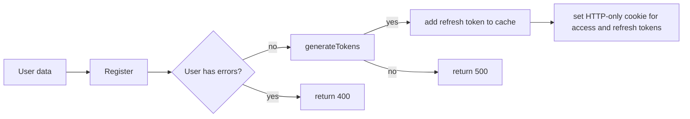
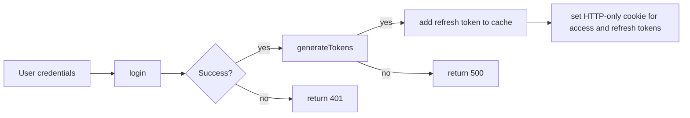
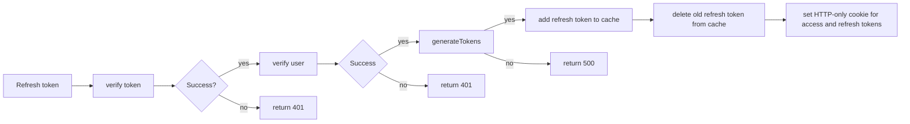
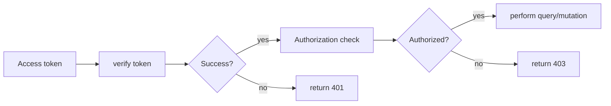

# DMSP Backend Prototype

# dmsp_frontend_prototype app


## Table of Contents
- [Introduction](#introduction)
- [Features](#features)
    - [Authentication](#authentication)
    - [GraphQL](#graphql)
- [Getting Started](#getting-started)
    - [Prerequisites](#prerequisites)
    - [Installation](#installation)
    - [Running the App](#running-the-app)
    - [Building for Production](#building-for-production)
    - [Managing the database](#managing-the-database)
- [Development](#development)
    - [Adding or updating GraphQL functionality](#adding-or-updating-graphql-functionality)
    - [Context](#context)
    - [Schemas](#graphql-schemas)
    - [Resolvers](#resolvers)
    - [Models](#models)
    - [Mocks](#mocks)
    - [Tests](#tests)
- [Environment variables](#environment-variables)
- [Routes](#routes)
- [Contributing](#contributing)
- [Contributors](#contributors)
- [License](#license)

## Introduction

This system is an [Apollo Server](https://www.apollographql.com/docs/apollo-server/) that support [GraphQL](https://graphql.org) interactions.

The primary purpose of this system is to be the backend for the [corresponding DMP Tool's nextJS based user interface](https://github.com/CDLUC3/dmsp_frontend_prototype?tab=readme-ov-file#running-the-app).

It has been decoupled from that system though in order to facilitate its use beyond the DMP Tool. For example if a University wants to develop an in-house integration, they can use the authentication endpoints to authenticate their users and interact with both templates and data management plans directly.

GraphQL makes these types of integrations easier than a standard REST API.

## Features

Our Apollo server consists of:
- Authentication: Endpoints that can be used to verify a user's identity and provision tokens that can then be used to access data.
- Data Sources: Code used to communicate with local databases, external APIs, caches and file systems
- GraphQL Schemas: The definition of our Graph including types, queries and mutations
- Resolvers: The code that processes incoming queries and uses the available data sources to generate the response
- Mocks: Stub or placeholder data that can be returned when a resolver has not yet been developed

### Authentication

The system provides a few endpoints that exist outside the Apollo Server GraphQL context. These endpoints allow a user to authenticate and acquire JSON web tokens which are placed into HTTP-only cookies. Those cookies are then used to perform authorization checks when running GraphQL queries.

The system generates a short lived (10 minute) access token `dmspt` that should be used on all requests to the GraphQL endpoint.

A longer lived (24 hour) refresh token `dmspr` is also generated. The refresh token can be used to refresh an expired access token. Doing so generates completely new access AND refresh tokens.

#### signupController
The signup controller responds to `POST` requests to `/apollo-signup`. It will validate the posted user data in the body of the request and attempt to create a new User record in the database.

If successful, a new User record is created and an access token and refresh token are generated. The refresh token is stored in the Redis cache and then both tokens are added to the response as HTTP-only cookies.

#### signinController
The signin controller responds to `POST` requests to `/apollo-signin`. It will validate the posted user email and password in the body of the request and attempt to locate the User record in the database. If the user is found the system will validate the password.

If successful, an access token and refresh token are generated. The refresh token is stored in the Redis cache and then both tokens are added to the response as HTTP-only cookies.

#### signoutController
The signout controller responds to `POST` requests to `/apollo-signout`. It will retrieve the access token from the request's HTTP-only cookies and attempt to verify the token. If the token is still valid it will proceed with the signout.

If successful, the refresh token will be removed from the Redis cache. Then the access token will be added to the black list on the Redis cache and then both HTTP-only cookies will be deleted.

#### refreshTokenController
The signout controller responds to `POST` requests to `/apollo-refresh`. It will retrieve the refresh token from the request's HTTP-only cookies and attempt to verify the token. If the token is still valid.

If successful, the refresh token will be removed from the Redis cache. Then a new access token and refresh token will be generated. The new refresh token will be added to the Redis cache and then both new tokens will be returned in the response's HTTP-only cookies.

#### GraphQL requests
The access token received from the authentication endpoints above will then be used by the system to determine whether or not a user is authorized to access data.


### GraphQL

GraphQL consists of:
- Schemas - the definition of the available data (e.g. a contributor or an answer to a DMP question) and what actions can be performed on that data
  - Queries - actions that can be taken to retrieve different types of data. GraphQL is extremely flexible and allows the caller to define exactly what portions of the data they want the query to return.
  - Mutations - actions that can be taken to create, modify or delete different types of data.
- Resolvers - an intermediary that receives the incoming query or mutation request and performs authoriation checks and basic validation before passing the request off to a model.
- Models - encapsulate the business logic that performs queries and mutations on data. The models understand where the data lives and how to interact with it.
- Data Sources - lower level logic that allows models to interact with data (e.g. a MySQL database, DynamoDB database, external API, etc.)

## Getting Started

### Prerequisites
- Node.js v21.6.0 or higher
- npm v10.2.0 or higher
- Docker Desktop -- Docker Desktop gives you Docker Engine, Docker CLI client, and Docker Compose

### Installation
- Clone this repository to your local machine
- Create your dotenv file the `cp ./.env.example ./.env`
- Update the new `.env` file if necessary (make sure it has no references to MYSQL unless you want to override the docker-compose db setings)
- Run `docker-compose build` to build the container
- Once the build has completed start the container with: `docker-compose up`
- In a separate tab run `docker-compose exec apollo bash ./data-migrations/database-init.sh` to create the database and build the `dataMigrations` table which will be used to track which data migrations have been run.
- Then run `docker-compose exec apollo bash ./data-migrations/process.sh` to build out the remaining database tables and seed them with sample data
- Visit `http://localhost:4000/graphql` to load the Apollo server explorer and verify that the system is running.

### Running the app

Once the application is installed and the database has been initialized you can start the Apollo server with: `docker-compose up`

This will startup a docker container that consists of a local Redis cache, a MariaDB database, and the Apollo server node.js application.

Once the container is up and running you can visit `http://localhost:4000/graphql` to load the Apollo server explorer and verify that the system is running. For an overview of how the explorer works, please refer to the offical [docs for the GraphOS Studio Explorer](https://www.apollographql.com/docs/graphos/explorer/)

### Building for production

You can manually build the application for your production environment by running `docker run build` and then `docker run start` to startup the application.

When deploying manually, you will need to ensure that all of the environment variables defined in the `.env.example` and the `docker-compose.yaml` are available to the application. This can be done via a `.env` file or environment variables.

If you plan on deploying to the AWS cloud, you can refer to the [corresponding AWS infrastructure repository](https://github.com/CDLUC3/dmsp_frontend_prototype?tab=readme-ov-file#running-the-app). For the CloudFormation templates needed to build this application using CodePipeline and then host it within an ECS cluster.

### Managing the database

#### Running database migrations

**Local Docker container**
- While the Docker container is up and running, just run `docker-compose exec apollo bash ./data-migrations/process.sh` in a seperate terminal window.

**AWS Cloud9 Bastion Host**
- Login to the AWS console and start the bastion cloud9 instance.
- Navigate to this repo on the instance (clone it if it is not there)
- Checkout the appropriate branch/tag and pull down the latest
- Run `./data-migrations/process.sh [env]`

#### Dropping all of the tables in the local database

In the event that you want to delete all of the tables and data from your database and rebuild a clean database you can run.

**Local Docker container**
- Drop the tables: `docker-compose exec apollo bash ./data-migrations/nuke-db.sh`
- Rebuild the tables and seed them: `docker-compose exec apollo bash ./data-migrations/process.sh`

Note that the container must be running!

You may find that you receive an error that the `dataMigrations` table already exists when running the `process.sh` script. If so, restart the container and try again.

**AWS Cloud9 Bastion Host**

NEVER EVER do this in production! You will lose ALL data.

- Login to the AWS console and start the bastion cloud9 instance.
- Navigate to this repo on the instance (clone it if it is not there)
- Checkout the appropriate branch/tag and pull down the latest
- Drop the tables: `./data-migrations/nuke-db.sh`
- Rebuild the tables and seed them: `./data-migrations/process.sh`

## Development

The local development environment is encapsulated within a docker container. To build and run the development Docker containers:
- `docker-compose build`
- `docker-compose up`
To stop the docker container, run:
`docker-compose down`
Run the following to check that your container is up:
`docker container ls -a`
To run bash commands within the container (e.g. to run DB migrations):
`docker-compose exec apollo bash path/to/script`

### Adding or updating GraphQL functionality

If you need to add additional Queries and/or Mutations, you will typically need to update 3 distinct sections of the Apollo server framework.
1. GraphQL Schema: The definition of the structure of an object and any queries and mutations that can be performed against that object.
2. Resolvers: Handlers for determining out how to respond to Query and Mutation requests
3. Models: The business logic associated with an object as well as how to interact with it's underlying data source (e.g. API calls, SQL queries, etc.)

#### Context
Our context is defined in `src/context.ts` and consists of several items that are instantiated when the server starts up or as part of processing the incoming request.
- **token**: The JWT token passed in the header of the request.
- **cache**: The Apollo server cache.
- **dataSources**: An object containing the MySQL DB connection pool and the DMPHub API wrapper

#### GraphQL schemas

[Official Apollo Server docs for schemas](https://www.apollographql.com/docs/apollo-server/schema/schema)

To add Queries or Mutations you should locate the appropriate schema in the `src/schemas` directory. If you have a completely new entity you want to add, then create a new schema file in that directory (use an existing one as reference) and then be sure to import it into `src/schemas.ts` and make sure it is getting passed to the Apollo server.

Once a schema has been added/modified, you will need to run `npm run generate` this kicks off a script that builds out Typescript Types for the new schema and queries.

#### Resolvers

[Official Apollo Server docs for resolvers](https://www.apollographql.com/docs/apollo-server/data/resolvers/)

Resolvers can be found in the `src/resolvers/` directory. You should have a corresponding Query and Mutation for each one defined within the GraphQL schema.

A resolver receives the following for each request:
- **parent**: The parent object (only applicable when chaining - see below)
- **input**: The query params received from the caller (e.g. templateId, email, etc.)
- **context**: The apollo server context (see below).
- **info**: N/A (so far)

Resolvers are responsible for doing basic input validation and performing authorization checks (e.g. is the person an ADMIN?). They then hand off the request to a Model.

#### Chaining
GraphQL using a concept called [chaining](https://www.apollographql.com/docs/apollo-server/data/resolvers#resolver-chains) to resolve complex queries that request access to multiple object types.
When you define a relationship between objects within the GraphQL schema, resolvers will be called when appropriate to retrieve each object.

For example, assume the following schema:
```
extend type Query {
  user(userId: Int!): User
}

type User {
  id: Int
  email: String!
  affiliation: Affiliation!
}
```

In this schema, we have a query to fetch a user record. The User object exposes a reference to an asscoiated affiliation.

GraphQL allows the caller to dictate what data they want to receive back from a query request. So, if the caller requests:
```
query user($userId: Int!) {
  user(userId: $userId) {
    email
  }
}
{
  "userId": 1
}
```
Apollo server will call the resolver for the user to fetch the email from the database but will ignore the associated affiliation because the caller did not request it.

If on the other hand the caller asked for the affiliation in the request:
```
query user($userId: Int!) {
  user(userId: $userId) {
    email
    affiliation {
      id
      name
    }
  }
}
{
  "userId": 1
}
```
Apollo server will call the resolver to get the email and affiliationId for the user from the database. Once it has retreived the affiliationId, it will make a subsequent call to the DMPHub API to fetch the ROR id and the name of the affiliation.

To define chainging in the resolver you would do something like this:
```
  Query: {
    // Resolver exposed by GraphQL
    user: async (_, { userId }, context: MyContext): Promise<User> => {
      return await User.findById('user resolver', context, userId);
    },
  },

  User: {
    // Chained resolver to fetch the Affiliation info for a user
    affiliation: async (parent: User, _, context): Promise<Affiliation> => {
      return Affiliation.findById('Chained User.affiliation', context, parent.affiliationId);
    },
  },
```

If you added a new resolver, be sure to import it into the `src/resolvers.ts` file and include it for Apollo Server.


### Models

Models can be found in the `src/models` directory. They typically contain all of the business logic for accessing and modifying data. They are called by Resolvers and interact with Data Sources.

They are also used to normalize data from the data sources before returning it to the caller. For example:
- If my data source returns a property called `funder_id` and I want to send a boolean flag called `isFunder` to the caller, I perform the logic in a Model.
- If I simply want to rename a property prior to returning it to the client like the data source returning `identifier` but needing to send `DMPId` to the caller.

There are abstract base classes available to help offload some of the redundant code. For example the MySqlModel provides standardized fields common to every DB record as well as `query`, `insert`, `update` and `delete` functions that handle calls to the DB.

### Mocks

In some situations, the data source will not be ready. In this scenario you can create a mock for use during development. Mocks live in `src/mocks/` and there is an example for affiliations there.

To use a mock, simply import it into your resolver and then setup your Query and Mutation handlers to interact with the canned mock data.

Note that mocks will refresh each time the server is restarted!

### Tests

You MUST add unit tests if you added or modified a Model! To do so, find the corresponding file (or add a new one) in the `src/models/__tests_/` directory.

Resolver tests are not yet particularly useful. We will be updating this to add these integration tests in the near future.

## Environment variables

See the `.env.example` file and the `docker-compose.yaml` for the list of environment variables currently required by the system.

If you are running locally and using the docker container, you simply need to make a copy of the `.env.example` file and update it's variables where appropriate: `cp .env.example .env`.

If you are running elsewhere, you will need to either make a copy of the `.env.example` as described above and add all of the variables for the `docker-compose.yaml` to it, OR set these environment variables up individually.

# Routes
- `/up` - a simple healthcheck endpoint which can be used by load balancers

- `/apollo-signin` - authenticate a user and receive an access token
- `/apollo-signup` - register a new user and receive an access token
- `/apollo-signout` - delete an access token
- `/apollo-refresh` - regenerate an expired access token

- `graphql` - perform a GraphQL query or mutation

- `/apollo-authenticate` - OAuth2 endpoint to authenticate an external system and receive an access token
- `/apollo-authorize` - OAuth2 endpoint to allow a user to authorize the external system to access their data. Returns a short lived authorization code
- `apollo-token` - OAuth2 endpoint to exchange an authorization code for a long lived access token

## Contributing

1. Clone this repo
2. Create a new branch prefixing branch with `bug`, `chore` or `feature` based on type of update: `git checkout -b feature/your-feature`
3. Add your changes and add commit message: `git add .; git commit -m "added new feature`. A pre-commit is run with the commit which checks to make sure linting and test coverage pass before a commit goes through
4. Push your branch up to this repo: `git push --set-upstream origin feature/your-feature`
5. Open a Pull Request in github

## Contributors

- [Brian Riley](https://github.com/briri)
- [Juliet Shin](https://github.com/jupiter007)
- [Andre Engelbrecht](https://github.com/andrewebdev)
- [Fraser Clark](https://github.com/fraserclark)

## License

This project is licensed under the MIT License - see the [LICENSE](LICENSE) for for details.
