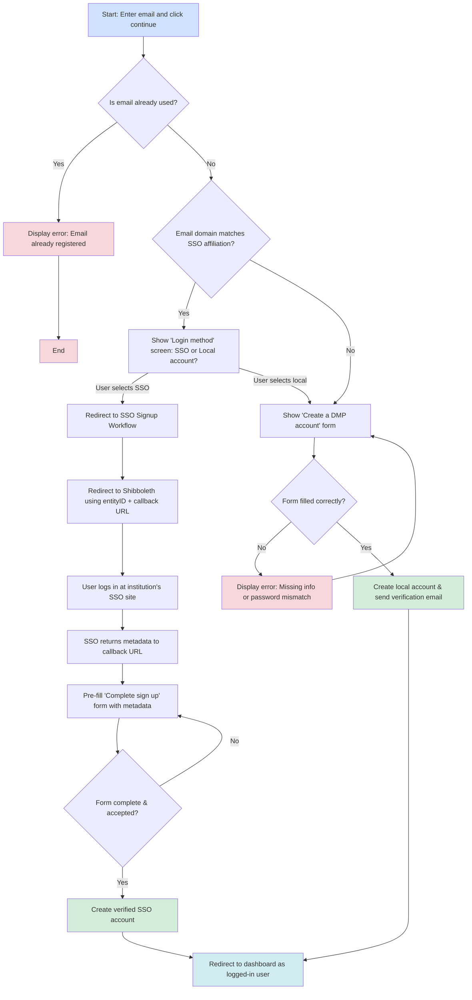
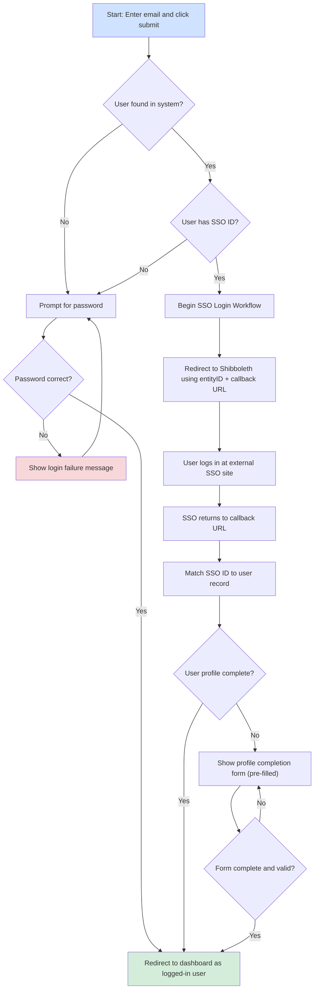

# Sign up, Sign in, and Validate workflows

## Diagram for Account Creation (both SSO and non-SSO)

## ACCOUNT CREATION workflow

1. Enter email address and click continue.
    a. If email is already used then display message that it is registered already and stop
2. If the email domain matches one that is present in the affiliations table and SSO is enabled then show the "Login method" screen which gives a choice to log in by SSO or with a local account.
3. If SSO is chosen then continue with SSO workflow, otherwise continue with the next step.
4. Go to the "Create a DMP account" form with First and Last name, institution autocomplete, email and password and confirm password, accept terms form elements that must be filled correctly.
    a. If there are problems with missing information or unmatched passwords then display message and require them to fill
5. On success, create their account with the information entered and send the user an email asking them to confirm their email.
6. Redirect to user dashboard as logged in user.

## SSO Signup Workflow
1. Affiliation detected from matching domain name of email and sent to shibboleth using the entityID associated with the affiliation along with a callback URL to go to after successful login. The affiliation ID is also passed through the shibboleth workflow.
2. Shibboleth redirects to the correct URL for login from their individual SSO.
3. After successful login, SSO returns some metadata about the user to the callback URL (metadata completeness may vary by institution).
4. Callback endpoint maps whatever metadata has been made available into the fields matching our sign up form.  The ID (email) from shibboleth they used for sign-in is put into the field ssoid. They are redirected to a "complete sign up" form with the data.
5. A "complete sign up" form is displayed which includes First/last name, institution pre-filled and read-only (based on the affiliation they used to log in), email pre-filled and read-only, and "accept terms." The ssoid is a hidden field and will be submitted as part of this form (it cannot be changed).
6. On submit with correct information, the user account is created already marked as verified since they validated their email by logging in by SSO. They are redirected to the user dashboard as a logged in user.

## Diagram for Login (both SSO and non-SSO)

## Login Workflow
1. The user is presented with a form that only asks for their email address and they click submit.
2. If the user isn't found or the user doesn't have an ssoid in their record then they're presented with a password field in the form.  Otherwise go to the SSO Login workflow
3. User enters their password and clicks login.
4. If the login is successful then they're redirected to the user dashboard as a logged in user, otherwise they see messages about login failure and are allowed to retry.

## Login SSO Workflow
1. The user's ssoid is used to match an affiliation based on the ssoid domain and the affiliation domain.  They are redirected using the shibboleth entityID for the affiliation and with a callback URL.
2. The user enters login credentials at their external SSO site.  Upon success they are redirected back to the callback URL.
3. At the callback URL for successful login, the ssoid is used to match to the user record.  If the user required fields are complete they have sign-in timestamps updated and they are then redirected to the user dashboard page.
4. If the user record does not contain all the required fields, they are presented with a form like the sign-up workflow with existing values pre-filled and must update it.
5. They are redirected to the dashboard page as a logged in user.

## Email Verification Diagram

Email verification may be triggered by signing up for a non-SSO account or by creating a new email alias for an existing account (from user profile area)

## Email verification workflow
1. On non-sso account creation or new alias email creation, a "verify your account" email is sent to the user with a verification token.
2. The user clicks the verification link.  (Do we need a separate "enter code" page if a user doesn't want to click links in an email?)
3. User is taken to an endpoint for verifying their email with their verification token.
  a. If the token isn't found or is expired (1 hour or 1 day expiration time?) then they receive a message that the link is not valid. If logged in, they also see a link to the page where they may generate another verification email.
4. When verification link is valid then their userEmails record for the email address that goes with the verification token is updated and isConfirmed is set to true. They see a message that <email> has been confirmed.  The verification token is marked as expired so it cannot be used again without regenerating a new verification token.
